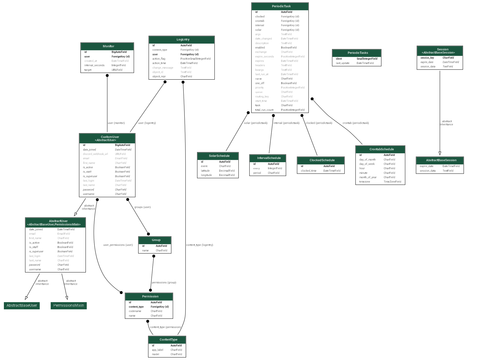

<div align="center">
    
    <p><strong>Cronly: </strong>A high-performance uptime monitoring tool.<br>Written in Python/Django</p>
</div>

## Features

- **Continuous Monitoring:** Customizable HTTP/HTTPS check intervals (minute to monthly).
- **Real-time Dashboard:** Live tracking of **status codes**, **DNS lookup time** and **HTTP response time**.
- **Dynamic Scheduling:** Create, update or delete monitors.
- **Discord Alerts:** Automated webhook notifications when a service goes offline.

## Database Schema



## Usage

### Local Development

First install `uv` and sync the project dependencies:

```bash
cd path/to/root/directory
pip install uv
uv sync
uv sync --extra dev  # for devs only
```

Migrate database:

```bash
uv run manage.py migrate
```

Start Redis server:

**Docker:** `docker run -d --name redis -p 6379:6379 redis`  
**Unix:** `sudo service redis-server start`

Run Django server via honcho (web server + celery worker + celery beat):

```bash
uv run honcho start
```

Access web application at `http://127.0.0.1:8000` or `http://localhost:8000`.
